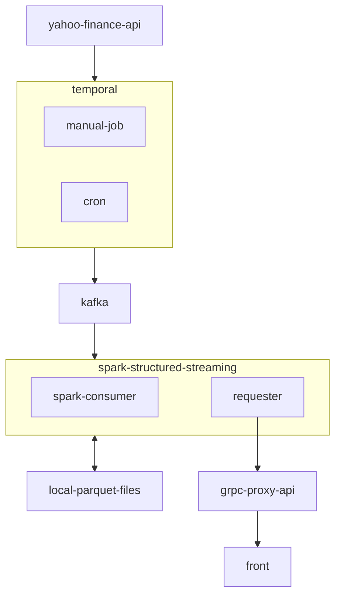

# my_tradingview

### Description
The goal of this project is to retrieve data from yahoo finance api (1 minutes interval) using kafka, spark, temporal, akka, grpc, nodejs and react with echarts for data-visualisation.

### Showcase


### Architecture



### Run it
- Run docker compose
    - ```docker-compose -f ./infra/docker-compose.yaml up -d```
- Run temporal workflows
    - ```./gradlew temporal-workflow:run```
- Run spark consumer
    - ```./gradlew spark-consumer:run```
- Run requester
    - ```./gradlew requester:run```
- Run grpc proxy
    - ```cd proxy && npm run start && cd ..```
- Run front
    - ```cd infra && npm run start && cd ..```
